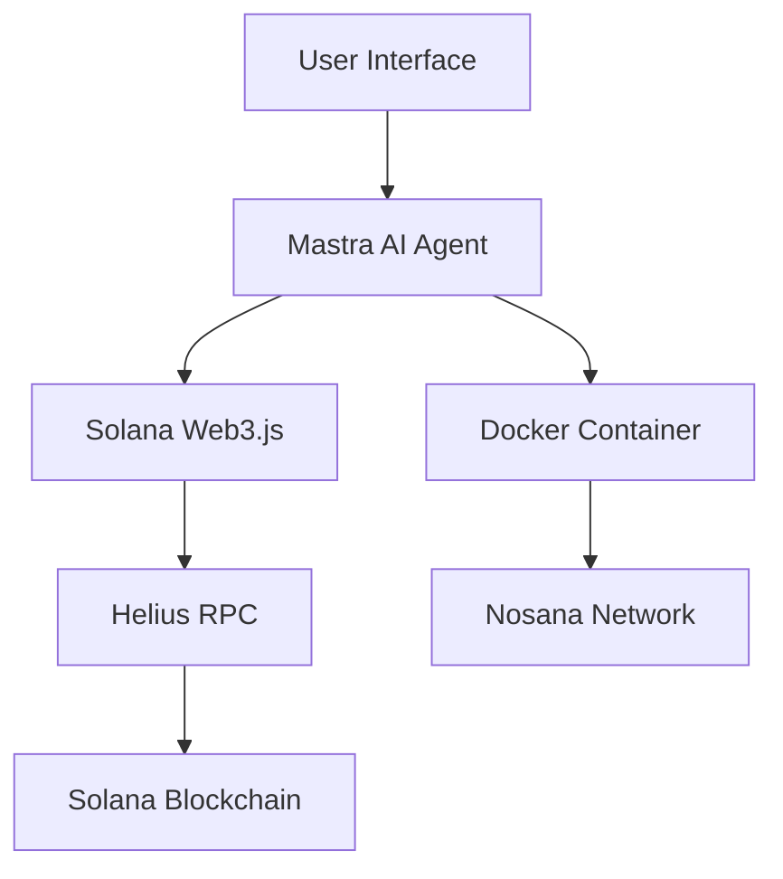

# 🌟 Solana AI Agent
*Blockchain Development Through Intelligent Automation*

<div align="center">


<a href="https://mastra.ai"></a>
<a href="https://nosana.io"></a>
<a href="https://solana.com"></a>

<br/>

<strong>Transform complex blockchain operations into simple conversations</strong>

<br/>

<a href="https://x.com/ajeyakumara07/status/1942319063415546197">
  
</a>

</div>

---

## What Makes This Special?

**Solana AI Agent** is a paradigm shift: just talk to your blockchain. No more wrestling with APIs or docs—simply chat. Powered by AI and deployed on Nosana, it redefines how you build on Solana.

- **Natural Language Processing**: No command-line gymnastics
- **Context-Aware**: Remembers your conversation
- **Smart Validation**: Prevents errors before they happen
- **Educational**: Learn as you build

---

## Features

| Token Operations      | Wallet Management    | Blockchain Explorer   | AI-Powered Automation |
|----------------------|---------------------|----------------------|-----------------------|
| Create SPL tokens    | Smart airdrops      | Real-time tracking   | Smart contract calls  |
| Mint & burn supply   | Balance monitoring  | Account analysis     | Batch operations      |
| Token analytics      | Transaction history | Program monitoring   | Risk assessment       |
| Metadata management  | Wallet validation   | Network stats        | Performance tips      |

---

## Tech Stack



| Component      | Technology         | Purpose                        |
|---------------|--------------------|--------------------------------|
| AI Framework  | Mastra             | Agent orchestration            |
| Runtime       | Node.js + TS       | Fast execution                 |
| Blockchain    | Solana Web3.js     | Blockchain integration         |
| RPC Provider  | Helius             | Network connectivity           |
| Container     | Docker             | Portable deployment            |
| Infrastructure| Nosana             | Decentralized hosting          |

---

## Quick Start Guide

**Prerequisites:** Node.js 18+, pnpm, Docker, Git

```bash
# Clone & enter repo
git clone https://github.com/yourusername/solana-ai-agent.git
cd solana-ai-agent

# Install dependencies
pnpm install

# Configure environment
cp .env.example .env
# Edit .env with your settings

# Launch dev server
pnpm run dev
```

Go to [http://localhost:8080](http://localhost:8080) and start chatting!

**.env essentials:**
```env
MODEL_NAME_AT_ENDPOINT=qwen2.5:1.5b
API_BASE_URL=http://localhost:11434
SOLANA_RPC_URL=https://api.helius.com/v1/your-api-key
SOLANA_PRIVATE_KEY=your-private-key-here
SOLANA_NETWORK=devnet  # or mainnet-beta
ENCRYPTION_KEY=your-encryption-key
RATE_LIMIT=100
```

---

## Docker & Nosana Deployment

**Build & Test Locally:**
```bash
docker build -t yourusername/solana-ai-agent:latest .
docker run -p 8080:8080 --env-file .env yourusername/solana-ai-agent:latest
```

**Publish:**
```bash
docker login
docker push yourusername/solana-ai-agent:latest
docker tag yourusername/solana-ai-agent:latest yourusername/solana-ai-agent:v1.0.0
docker push yourusername/solana-ai-agent:v1.0.0
```

**Deploy on Nosana:**
- Edit `nos_job_def/nosana_mastra.json` with your Docker image
- Use CLI:
```bash
npm install -g @nosana/cli
nosana address # check wallet
nosana job post --file nosana_mastra.json --market nvidia-3060 --timeout 30
```
- Or use [Nosana Dashboard](https://dashboard.nosana.com/deploy)

---

## Usage Examples

```plaintext
"Create a new SPL token called 'SuperCoin' with symbol 'SUPER' and initial supply of 1,000,000 tokens"
"Airdrop 50 SOL to these 5 wallets: [wallet1, wallet2, wallet3, wallet4, wallet5]"
"Show me analytics for token mint 7xKXtg2CW87d97TXJSDpbD5jBkheTqA83TZRuJosgAsU"
"What's the balance and transaction history for wallet 9WzDXwBbmkg8ZTbNMqUxvQRAyrZzDsGYdLVL9zYtAWWM?"
"Help me create a token with anti-whale mechanisms"
```

---

## Testing & Quality

```bash
pnpm run dev      # Start dev server
pnpm run test     # Run tests
pnpm run audit    # Security audit
```

**Checklist:**
- [ ] Agent responds to all queries
- [ ] Tools execute successfully
- [ ] Handles errors gracefully
- [ ] Fast responses (<3s)
- [ ] No sensitive data leaks
- [ ] Docker image runs cleanly

---

## Nosana Builders Challenge

- ✅ **Innovation**: Natural language blockchain interface
- ✅ **Technical Excellence**: Robust Mastra framework
- ✅ **Nosana Integration**: Seamless deployment
- ✅ **Real-World Impact**: Practical for devs & users

---

## Documentation & Resources

- [Mastra Docs](https://mastra.ai/docs)
- [Solana Cookbook](https://solanacookbook.com)
- [Nosana Docs](https://docs.nosana.io)
- **Live Demo**: [Your Nosana Deployment URL]
- **GitHub**: [Your Repository]
- **Docker Hub**: [Your Container Registry]
- **Demo Video**: [Your YouTube/Loom Link]
- **Discord**: [Nosana Community](https://nosana.com/discord)
- **Twitter**: [@nosana_ai](https://x.com/nosana_ai)

---

## What's Next?
- Multi-chain support (ETH, Polygon, BSC)
- ML-powered analytics
- DeFi integrations
- Mobile app

**Contributions welcome! See [CONTRIBUTING.md](CONTRIBUTING.md).**

---

<div align="center">

### Ready to Transform Blockchain Development?

<a href="https://dashboard.nosana.com/deploy"></a>
<a href="https://docs.nosana.io"></a>
<a href="https://nosana.com/discord"></a>

<br/>

**Built with ❤️ by the Solana community**


</div>

---

**#Solana #AI #Blockchain #Nosana #Mastra #Web3 #DeFi #Automation #Innovation #NosanaAgentChallenge**
