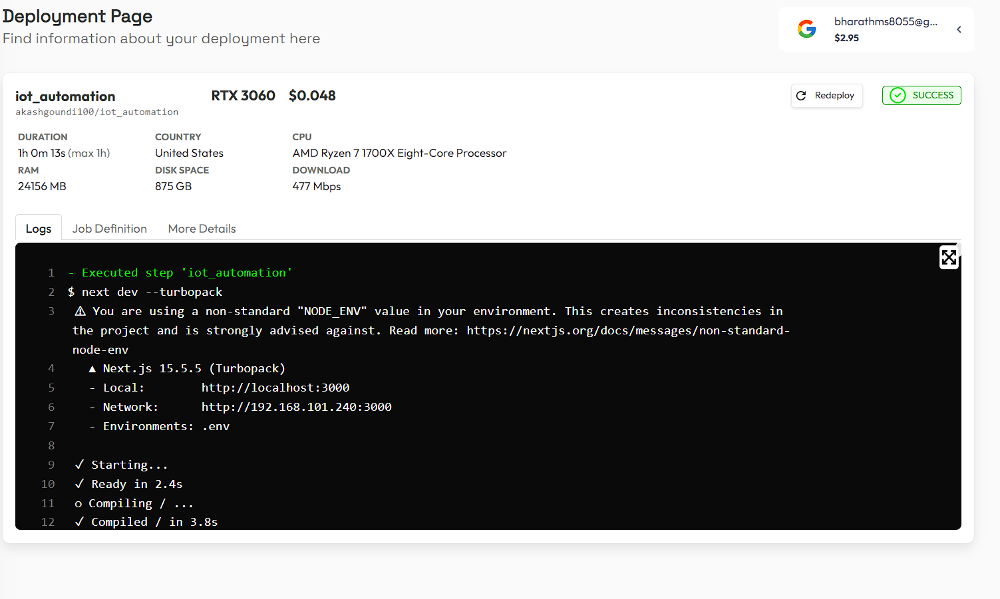

# ESP32 Project Generator & Control Platform
> An AI-powered platform that helps you create, manage, and control ESP32 IoT projects using natural language.

Video Demo(https://x.com/bharathms443/status/1984406587096580468)
*Click to watch the demo video (7 min): 5 min project walkthrough + 2 min Nosana deployment*

## 🤖 AI Agents Overview


This project leverages three specialized AI agents to handle different aspects of IoT project creation and management:

### 1. Project Planner Agent
- Understands natural language project descriptions
- Designs IoT project architecture including components, sensors, and outputs
- Plans MQTT topics and communication flow
- Generates project metadata and configuration

### 2. Code Generator Agent
- Takes project plans and generates ESP32 firmware code
- Handles WiFi, MQTT, and sensor integrations
- Implements automation rules and trigger responses
- Generates well-documented, ready-to-flash code

### 3. Triggering Agent
- Manages real-time device control through voice or text
- Handles natural language commands and converts them to MQTT messages
- Waits for device acknowledgments
- Provides voice feedback on command execution

## 🛠️ Tools & Features

### Memory System (Redis)
- Persistent agent memory using Redis
- Stores project history and context
- Initialization via `initial_memory.ts`
- Memory updates through `agent-memory-update.ts`

### MQTT Communication
- Real-time device control using MQTT
- Topic publication with acknowledgment waiting
- Automated reconnection and error handling
- Bi-directional communication with ESP32 devices

## 🚀 Local Setup

1. **Clone & Install**
```bash
git clone https://github.com/YOUR_USERNAME/agent-challenge
cd agent-challenge
bun install
```

2. **Environment Setup**
```bash
cp .env.example .env
# Edit .env with your configuration
```

3. **Start Development Servers**
```bash
# Terminal 1: Start Next.js UI
bun run dev:ui

# Terminal 2: Start Mastra Agent Playground
bun run dev:agent
```

The UI will be available at http://localhost:3000  
Mastra Playground at http://localhost:4111

## 📦 Nosana Deployment

1. **Build Docker Image**
```bash
docker build -t yourusername/agent-challenge:latest .
docker push yourusername/agent-challenge:latest
```

2. **Deploy on Nosana**
- Open Nosana Dashboard
- Edit `nosana_mastra_job_definition.json`:
  ```json
  {
    "image": "yourusername/agent-challenge:latest",
    "ports": ["3000:3000", "4111:4111"]
  }
  ```
- Submit job and monitor deployment



## 🎥 Video Overview

The project demo video covers:
1. (0:00-5:00) Project Walkthrough
   - Agent architecture and interactions
   - UI demonstration
   - IoT project creation flow
   - Real device control demo

2. (5:00-7:00) Nosana Deployment
   - Docker image creation
   - Nosana dashboard walkthrough
   - Live deployment demonstration

## 🔗 Links
- [Twitter Demo](https://x.com/bharathms443/status/1984406587096580468)
- [Nosana Dashboard ](https://dashboard.nosana.com/jobs/EXEk74jc2azchXnteyxRKeKS1RVsGH6BEG1pZLCDZ5SC)
- [Docker Image](https://hub.docker.com/r/akashgoundi100/iot_automation)

## 📄 License
MIT License - See [LICENSE](./LICENSE) for details


```bash
# Fork this repo on GitHub, then clone your fork
git clone https://github.com/YOUR-USERNAME/agent-challenge

cd agent-challenge

cp .env.example .env

pnpm i

pnpm run dev:ui      # Start UI server (port 3000)
pnpm run dev:agent   # Start Mastra agent server (port 4111)
```

Open <http://localhost:3000> to see your agent in action in the frontend.
Open <http://localhost:4111> to open up the Mastra Agent Playground.

#### **Step 2: Choose Your LLM for Development (Optional)**

Pick one option below to power your agent during development:

##### Option A: Use Shared Nosana LLM Endpoint (Recommended - No Setup!)

We provide a free LLM endpoint hosted on Nosana for development. Edit your `.env`:

```env
# Qwen3:8b - Nosana Endpoint
# Note baseURL for Ollama needs to be appended with `/api`
OLLAMA_API_URL=https://3yt39qx97wc9hqwwmylrphi4jsxrngjzxnjakkybnxbw.node.k8s.prd.nos.ci/api
MODEL_NAME_AT_ENDPOINT=qwen3:8b
```

If it goes down, reach out on [Discord](https://discord.com/channels/236263424676331521/1354391113028337664)

##### Option B: Use Local LLM

Run Ollama locally (requires [Ollama installed](https://ollama.com/download)):

```bash
ollama pull qwen3:0.6b
ollama serve
```

Edit your `.env`:
```env
OLLAMA_API_URL=http://127.0.0.1:11434/api
MODEL_NAME_AT_ENDPOINT=qwen3:0.6b
```

##### Option C: Use OpenAI

Add to your `.env` and uncomment the OpenAI line in `src/mastra/agents/index.ts`:

```env
OPENAI_API_KEY=your-key-here
```


