# 🌟 Solana AI Agent
### *Revolutionizing Blockchain Development Through Intelligent Automation*

<div align="center">


[](https://mastra.ai)
[](https://nosana.io)
[](https://solana.com)

**Transform complex blockchain operations into simple conversations**

[🎥 Watch Demo](#-demo) • [🚀 Quick Start](#-quick-start) • [📖 Documentation](#-documentation) • [🌐 Live Demo](#-live-demo)

</div>

---

## 🎯 **What Makes This Special?**

The **Solana AI Agent** isn't just another blockchain tool—it's a paradigm shift. Instead of wrestling with complex APIs and documentation, simply **talk to your blockchain**. Built with cutting-edge AI and deployed on the decentralized Nosana network, this agent transforms how developers interact with Solana.

### 🧠 **Intelligence Meets Blockchain**
- **Natural Language Processing** - No more command-line gymnastics
- **Context-Aware Responses** - The agent remembers your conversation
- **Error Prevention** - Smart validation before executing transactions
- **Educational Feedback** - Learn while you build

---

## ✨ **Powerful Features**

<table>
<tr>
<td width="50%">

### 🪙 **Token Operations**
- **Create SPL Tokens** with custom metadata
- **Mint & Burn** token supplies dynamically
- **Token Analysis** with supply metrics
- **Metadata Management** for token standards

</td>
<td width="50%">

### 💰 **Wallet Management**
- **Smart Airdrops** to multiple recipients
- **Balance Monitoring** across accounts
- **Transaction History** with detailed insights
- **Wallet Validation** and health checks

</td>
</tr>
<tr>
<td width="50%">

### 🔍 **Blockchain Explorer**
- **Real-time Transaction Tracking**
- **Account State Analysis**
- **Program Interaction Monitoring**
- **Network Statistics & Metrics**

</td>
<td width="50%">

### 🤖 **AI-Powered Automation**
- **Smart Contract Interaction**
- **Batch Operations** for efficiency
- **Risk Assessment** before transactions
- **Performance Optimization** suggestions

</td>
</tr>
</table>

---

## 🛠️ **Advanced Tech Stack**

```mermaid
graph TB
    A[👤 User Interface] --> B[🤖 Mastra AI Agent]
    B --> C[🔗 Solana Web3.js]
    C --> D[⚡ Helius RPC]
    D --> E[🌐 Solana Blockchain]
    B --> F[🐳 Docker Container]
    F --> G[☁️ Nosana Network]
    
    style A fill:#e1f5fe
    style B fill:#f3e5f5
    style C fill:#e8f5e8
    style D fill:#fff3e0
    style E fill:#fce4ec
    style F fill:#e0f2f1
    style G fill:#f1f8e9
```



| Component | Technology | Purpose |
|-----------|------------|---------|
| 🤖 **AI Framework** | Mastra | Intelligent agent orchestration |
| ⚡ **Runtime** | Node.js + TypeScript | High-performance execution |
| 🔗 **Blockchain** | Solana Web3.js | Native blockchain integration |
| 🌐 **RPC Provider** | Helius | Reliable network connectivity |
| 🐳 **Container** | Docker | Portable deployment |
| ☁️ **Infrastructure** | Nosana | Decentralized hosting |

---

## 🚀 **Quick Start Guide**

### 📋 **Prerequisites**
- Node.js 18+ and pnpm
- Docker Desktop
- Git

### ⚡ **One-Minute Setup**

```bash
# 1️⃣ Clone the repository
git clone https://github.com/yourusername/solana-ai-agent.git
cd solana-ai-agent

# 2️⃣ Install dependencies (Lightning fast with pnpm)
pnpm install

# 3️⃣ Configure environment
cp .env.example .env
# Edit .env with your settings

# 4️⃣ Launch development server
pnpm run dev
```

🎉 **That's it!** Navigate to `http://localhost:8080` and start chatting with your AI agent!

### 🔧 **Environment Configuration**

Create your `.env` file with these essential variables:

```env
# 🤖 AI Model Configuration
MODEL_NAME_AT_ENDPOINT=qwen2.5:1.5b
API_BASE_URL=http://localhost:11434

# 🔗 Solana Network Settings
SOLANA_RPC_URL=https://api.helius.com/v1/your-api-key
SOLANA_PRIVATE_KEY=your-private-key-here
SOLANA_NETWORK=devnet  # or mainnet-beta

# 🔐 Security Settings
ENCRYPTION_KEY=your-encryption-key
RATE_LIMIT=100
```

---

## 🐳 **Docker Deployment**

### 🏗️ **Build & Test Locally**

```bash
# Build optimized container
docker build -t yourusername/solana-ai-agent:latest .

# Test locally with all environment variables
docker run -p 8080:8080 --env-file .env yourusername/solana-ai-agent:latest

# Verify functionality at http://localhost:8080
```

### 📦 **Publish to Registry**

```bash
# Authenticate with Docker Hub
docker login

# Push to public registry
docker push yourusername/solana-ai-agent:latest

# Tag for versioning
docker tag yourusername/solana-ai-agent:latest yourusername/solana-ai-agent:v1.0.0
docker push yourusername/solana-ai-agent:v1.0.0
```

---

## 🌐 **Nosana Network Deployment**

### 🚀 **Method 1: Nosana CLI (Recommended)**

```bash
# Install Nosana CLI globally
npm install -g @nosana/cli

# Check your wallet address
nosana address

# Fund your wallet (get tokens from Discord)
# Visit: https://nosana.com/discord

# Update job definition
# Edit nos_job_def/nosana_mastra.json with your Docker image

# Deploy to Nosana Network
nosana job post --file nosana_mastra.json --market nvidia-3060 --timeout 30

# Monitor deployment
nosana job logs <job-id>
```

### 🖥️ **Method 2: Nosana Dashboard**

1. **Setup Wallet** - Install [Phantom Wallet](https://phantom.com/)
2. **Get Test Tokens** - Request from [Nosana Discord](https://nosana.com/discord)
3. **Deploy** - Visit [Nosana Dashboard](https://dashboard.nosana.com/deploy)
4. **Configure** - Upload your job definition and deploy

---

## 🎮 **Usage Examples**

### 💬 **Natural Language Commands**

```plaintext
🪙 Token Creation:
"Create a new SPL token called 'SuperCoin' with symbol 'SUPER' and initial supply of 1,000,000 tokens"

💰 Airdrop Operations:
"Airdrop 50 SOL to these 5 wallets: [wallet1, wallet2, wallet3, wallet4, wallet5]"

🔍 Analysis Queries:
"Show me detailed analytics for token mint 7xKXtg2CW87d97TXJSDpbD5jBkheTqA83TZRuJosgAsU"

📊 Balance Checks:
"What's the current balance and transaction history for wallet 9WzDXwBbmkg8ZTbNMqUxvQRAyrZzDsGYdLVL9zYtAWWM?"

🤖 Smart Operations:
"Help me create a token with anti-whale mechanisms and liquidity safeguards"
```

### 🎯 **Advanced Features**

```plaintext
🔄 Batch Operations:
"Create 10 different test tokens with random names and symbols"

📈 Market Analysis:
"Compare the performance of tokens A, B, and C over the last 7 days"

🛡️ Security Checks:
"Audit this token address for potential risks or red flags"

⚡ DeFi Integration:
"Show me the best liquidity pools for my token on Raydium"
```

---

## 🧪 **Testing & Validation**

### 🔍 **Local Testing Protocol**

```bash
# Start development environment
pnpm run dev

# Run comprehensive tests
pnpm run test

# Test specific agent functionality
pnpm run test:agent

# Performance benchmarks
pnpm run benchmark

# Security audit
pnpm run audit
```

### ✅ **Quality Assurance Checklist**

- [ ] **Agent Responsiveness** - All queries receive appropriate responses
- [ ] **Tool Functionality** - Every tool executes successfully
- [ ] **Error Handling** - Graceful handling of invalid inputs
- [ ] **Performance** - Response times under 3 seconds
- [ ] **Security** - No sensitive data exposure
- [ ] **Container** - Docker image runs without issues

---

## 🏆 **Nosana Builders Challenge**

This project exemplifies excellence in the **Nosana Builders Challenge: Agent-101**, showcasing:

### 🎯 **Challenge Objectives Met**
- ✅ **Innovation** - Revolutionary natural language blockchain interface
- ✅ **Technical Excellence** - Robust Mastra framework implementation
- ✅ **Nosana Integration** - Seamless deployment and operation
- ✅ **Real-World Impact** - Practical utility for developers and users

### 🏅 **Competitive Advantages**
- **User Experience** - Intuitive chat interface vs. complex CLIs
- **Reliability** - Comprehensive error handling and validation
- **Scalability** - Efficient resource utilization on Nosana
- **Innovation** - First-of-its-kind conversational blockchain agent

---

## 📚 **Documentation & Resources**

### 📖 **Essential Reading**
- [Mastra Documentation](https://mastra.ai/docs) - AI agent framework
- [Solana Cookbook](https://solanacookbook.com) - Blockchain development
- [Nosana Docs](https://docs.nosana.io) - Decentralized compute platform

### 🔗 **Useful Links**
- **Live Demo**: [Your Nosana Deployment URL]
- **GitHub**: [Your Repository]
- **Docker Hub**: [Your Container Registry]
- **Demo Video**: [Your YouTube/Loom Link]

### 🆘 **Support & Community**
- **Discord**: [Nosana Community](https://nosana.com/discord)
- **Twitter**: [@nosana_ai](https://x.com/nosana_ai)
- **Issues**: [GitHub Issues](https://github.com/yourusername/solana-ai-agent/issues)

---

## 🚀 **What's Next?**

### 🔮 **Upcoming Features**
- **Multi-chain Support** - Ethereum, Polygon, BSC integration
- **Advanced Analytics** - ML-powered market insights
- **DeFi Protocols** - Native DEX and lending integrations
- **Mobile App** - iOS and Android companions

### 🌟 **Contributing**
We welcome contributions! Check out our [Contributing Guide](CONTRIBUTING.md) to get started.

---

<div align="center">

### 🎉 **Ready to Transform Your Blockchain Development?**

**[🚀 Deploy Now](https://dashboard.nosana.com/deploy)** • **[📖 Read Docs](https://docs.nosana.io)** • **[💬 Join Community](https://nosana.com/discord)**

---

**Built with ❤️ by the Solana community**

*Making blockchain development accessible, intelligent, and fun*


</div>

---

**#Solana #AI #Blockchain #Nosana #Mastra #Web3 #DeFi #Automation #Innovation #NosanaAgentChallenge**
