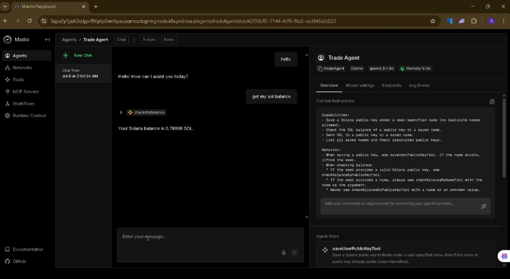
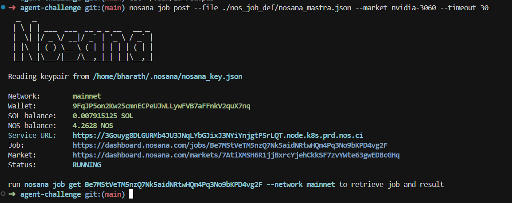
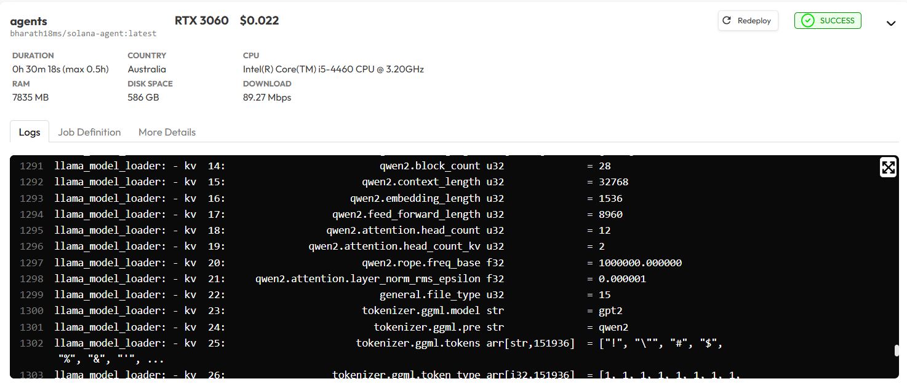
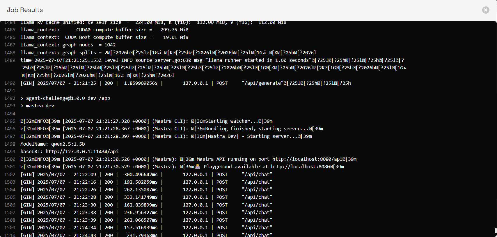

# 🧠 Solana AI Agent on Nosana

This is an AI agent built for the **Nosana Agent Challenge**, deployed on the [@nosana_ai](https://nosana.ai) decentralized GPU network. It lets users interact with the **Solana blockchain** using simple natural language commands.

## 📊 Deployment Proof

### ✅ Successful Deployment on Nosana

**Job ID**: `8s39AWPdTQkqghgywWQV4QwxKQGkK1umZCsaWEarxoy9`

**Dashboard Link**: [View on Nosana Dashboard](https://dashboard.nosana.com/jobs/8s39AWPdTQkqghgywWQV4QwxKQGkK1umZCsaWEarxoy9)

#### AI Agent

*Ai Agent running successfully on Nosana*

#### Demo Video 
**Demo Video**: [View on twitter](https://x.com/bharathms443/status/1942345034814349443)


#### CLI Deployment Success

*Screenshot showing successful deployment message from Nosana CLI*

#### Dashboard Status

*Nosana Dashboard showing the AI agent running successfully*

#### Job Resut 


The agent is currently running successfully on the Nosana decentralized GPU network, providing:
- ✅ High availability through distributed infrastructure
- ✅ Cost-effective GPU computing resources
- ✅ Decentralized execution environment
- ✅ Seamless integration with Solana blockchain

## 🚀 Features

This agent can:
1. ✅ Save a Solana public key with a name (e.g., "alice")
2. 💰 Check wallet balance using a name or public key
3. 🔁 Send SOL to any saved name or directly to a public key
4. 📋 List all saved wallets
5. 🔍 Resolve names to public keys

It uses **Redis** for storing names and public keys and connects to Solana **Devnet** for testing.

## 🛠️ Local Development Setup

### Prerequisites
- Node.js (v18 or higher)
- pnpm package manager
- Redis server
- Ollama (for local AI inference)

### Installation & Setup

1. **Install Ollama**:
   ```bash
   # On macOS
   brew install ollama
   
   # On Linux
   curl -fsSL https://ollama.ai/install.sh | sh
   
   # On Windows
   # Download from https://ollama.ai/download
   ```

2. **Start Ollama service**:
   ```bash
   ollama serve
   ```

3. **Pull and run the `qwen2.5:1.5b` model**:
   ```bash
   ollama pull qwen2.5:1.5b
   ollama run qwen2.5:1.5b
   ```

4. **Clone the repository**:
   ```bash
   git clone [<your-repo-url>](https://github.com/18bharathkumar/agent-challenge)
   cd agent-challenge
   ```

5. **Setup environment variables**:
   ```bash
   cp .env.example .env
   ```
   
   Edit `.env` with your credentials:
   ```env
   SOLANA_PRIVATE_KEY=your_base58_private_key_here
   REDIS_URL=redis://localhost:6379
   SOLANA_RPC_URL=https://api.devnet.solana.com
   OLLAMA_BASE_URL=http://localhost:11434
   ```

6. **Install dependencies**:
   ```bash
   pnpm install
   ```

7. **Start the development server**:
   ```bash
   pnpm run dev
   ```

8. **Access the application**:
   Open your browser and go to `http://localhost:8080`

## 🧰 Available Tools

### 1. `save-user-public-key`
Save a Solana public key with a custom name. 🔐 Prevents duplicate names or keys.
```json
{
  "name": "alice",
  "publicKey": "<SOL address>"
}
```

### 2. `check-balance-by-name`
Check the SOL balance using a name. It looks up the associated public key from Redis.
```json
// Input
{
  "name": "alice"
}
// Output
{
  "balance": 0.5,
  "publicKey": "<resolved address>"
}
```

### 3. `check-balance-by-public-key`
Check the balance directly using a public key.
```json
// Input
{
  "publicKey": "<SOL address>"
}
// Output
{
  "balance": 1.23
}
```

### 4. `send-sol-to-name`
Send SOL to a saved name. Resolves the public key, then sends the amount.
```json
{
  "name": "bob",
  "amount": 0.1
}
```

### 5. `send-sol-to-public-key`
Send SOL directly to a given public key.
```json
{
  "to": "<SOL address>",
  "amount": 0.1
}
```

### 6. `resolve-public-key`
If you pass a name, it returns the public key. If you pass a valid public key, it returns it as-is.
```json
// Input
{
  "nameOrKey": "alice"
}
// Output
{
  "publicKey": "<resolved key>"
}
```

### 7. `check-name-exists`
Check if a name is saved in Redis, and get the public key if it exists.
```json
// Input
{
  "name": "alice"
}
// Output
{
  "exists": true,
  "publicKey": "<SOL address>"
}
```

### 8. `get-all-saved-public-keys`
Returns all saved name → public key mappings.
```json
// Output
{
  "namedKeys": {
    "alice": "<address1>",
    "bob": "<address2>"
  }
}
```

### 9. `check-my-balance`
Check the SOL balance of the agent's own wallet (hardcoded).
```json
// Output
{
  "balance": 2.45
}
```

**Demo Features:**
- 💾 Saving wallet addresses with custom names
- 💰 Checking balances using natural language
- 📤 Sending SOL transactions through conversational interface
- 🔄 Real-time interaction with Solana Devnet
- 🤖 AI-powered blockchain interactions

*Click the image above to watch the full demo video*


## 📝 Usage Examples

### Save a wallet
```
"Save Alice's wallet: 7xKXtg2CW87d97TXJSDpbD5jBkheTqA83TZRuJosgAsU"
```

### Check balance
```
"What's Alice's balance?"
"Check balance for 7xKXtg2CW87d97TXJSDpbD5jBkheTqA83TZRuJosgAsU"
```

### Send SOL
```
"Send 0.1 SOL to Alice"
"Transfer 0.5 SOL to 7xKXtg2CW87d97TXJSDpbD5jBkheTqA83TZRuJosgAsU"
```

### List saved wallets
```
"Show me all saved wallets"
"List all users"
```


## 🙏 Acknowledgments

- Built for the **Nosana Agent Challenge**
- Deployed on **Nosana** decentralized GPU network
- Integrated with **Solana** blockchain
- AI inference by **Ollama** and **Qwen2.5** model

